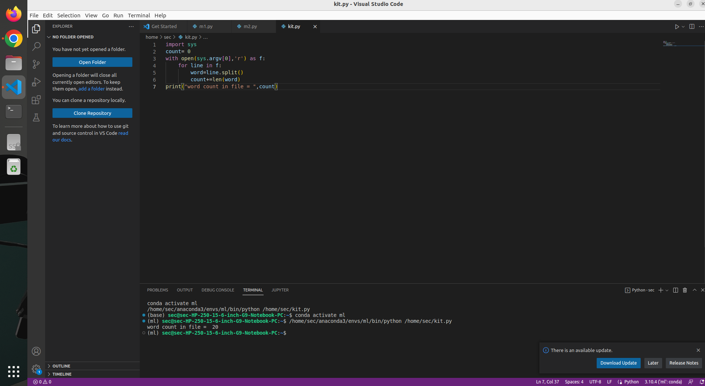

# command-line-arguments-to-count-word
## AIM:
To write a python program for getting the word count from the contents of a file using command line arguments.
## EQUIPEMENT'S REQUIRED: 
PC
Anaconda - Python 3.7
## ALGORITHM: 
### Step 1:
imort sys
### Step 2: 
 open the file in read mood
### Step 3: 
 use the for loop
### Step 4:  
use len function to count the number of words
### Step 5: 
print the statement " word count in file = "
### Step 6: 
run the programe to get the output
## PROGRAM:
```python
developed by : Rasika.M
Register number: 22005459

import sys
count= 0
with open(sys.argv[0],'r') as f:
    for line in f:
        word=line.split()
        count+=len(word)
print("word count in file = ",count)
```

### OUTPUT:



## RESULT:
Thus the program is written to find the word count from the contents of a file using command line arguments.
